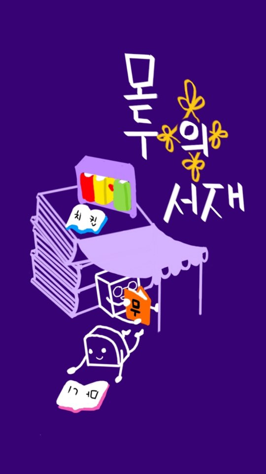

# Shelf #

**Shelf** is a Book Management and Social Networking Application. With **Shelf**, you can organize books, or make lists of them. You can also trade books like flee market. Unlike other organizing apps, **Shelf** is easy to customize and extend, and can be updated through Google Play Store application updates.

## Performance
[Shelf](https://github.com/chickenmujoa/shelf) can organize books, search, and buy e-Books.

## Communication
* GitHub issues: bug reports, usage issues, feature requests
* Mailing list: [chickenmujoa@gmail.com](mailto:chickenmujoa@gmail.com)

## Contributing
Any kind of contribution is welcome. For bug reports, feature requests,
please just open an issue without any hesitation. For code contributions, it's
strongly suggested to open an issue for discussion first.

## License
[Apache License 2.0](LICENSE).

## Acknowledgement

